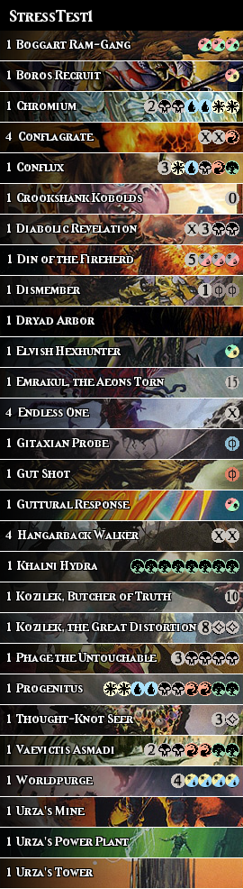

# StackIt

Python2 script generating a column-shaped TCG decklist based on cropped captions of each card's art.

## Requirements
This script was written on a Mac OSX Sierra (10.12.3) and as such relies on a couple of specific items:  
  (1) Python 2.7
  (2) PIL, lxml, and requests (install with `pip install -r requirements.txt`)  

## Roadmap
The initial upload is the version of the script as of March 7, 2017: it allows generating a visual decklist for Magic: the Gathering decks. The main features of this version are:  
  (1) final picture is generated as a .png file;  
  (2) reads the decklist from a file name given as a variable on the command line (rather than hard-coded in the script, giving user some flexibility);  
  (3) includes a title header based on the name of the decklist;  
  (4) has the default option of Unhinged art for all basic lands (Magic: the Gathering decks).
  

Already in development is:  
  (1) support for other TCG's: Pokemon, Hex are the main ones requested so far. The distinction between each game is done on the decklist file by giving it the proper extension: .mtg for Magic: the Gathering, .pkm for Pokemon, .hex for Hex;  
  (2) support for EDH decklists (Magic: the Gathering): make the display more comfortable for 100 card, singletong decks.


Finally, I would like to thank the community for its incredible feedback and support. What started as a small pet project for myself quickly blew up and is now being posted here on GitHub. It feels both awesome and surreal!

## Usage
** Run the script (Beta version)

From the command prompt:
> python StackIt.py decklist.dec

The decklist name does not really matter in the Beta version, as long as the extension does not exceed 3 characters (.dec, .mtg or other). The output file will be an image file named 'decklist.png'.


** Sample input decklist format

The decklist file should look like this:

```
4 Gifts Ungiven  
4 Vendilion Clique / MM2 
```

The separation ' / ' is necessary in the current Beta version to request a specific card art by adding the 3 letter code of the corresponding set - e.g. MM2 for the Modern Master 2015 art of Vendilion Clique.

To test the Beta version, the decklist StressTest1.dec is provided.

## Sample Output

